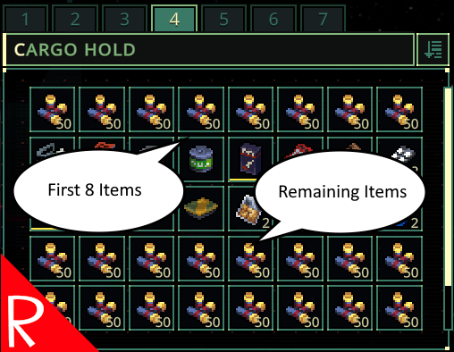

# Quasimorph SortExcess

Scrolling through multiple pages of the same item just to find the 3rd item in the list?

This mod changes the sort so that each item type will have a maximum of eight slots filled at the top of inventory screen, and then the rest will be put at the bottom.

The number of slots can be configured.  See the [Configuration section](#configuration).

# Requirements
Requires the Improved Item Sort mod.  
On Steam: https://steamcommunity.com/sharedfiles/filedetails/?id=3287329716&searchtext=sort
On GitHub: https://github.com/NBKRedSpy/QM_ImprovedSort

# Configuration

This mod supports MCM, which adds a Mod button on the main menu.  The settings can be changed there or directly in the config file covered below.

The configuration file will be created on the first game run and can be found at `%AppData%\..\LocalLow\Magnum Scriptum Ltd\Quasimorph_ModConfigs\SortExcess\config.json`.

|Name|Default|Description|
|--|--|--|
|MaxItems|8|The maximum number of items to put to the top of the sort.|

# Buy Me a Coffee
If you enjoy my mods and want to buy me a coffee, check out my [Ko-Fi](https://ko-fi.com/nbkredspy71915) page.
Thanks!

# Credits
Special thanks to Crynano for his excellent Mod Configuration Menu.

# Source Code
Source code is available on GitHub at https://github.com/NBKRedSpy/QM_SortExcess

# Change Log

# 1.1.0
* Added MCM integration.
